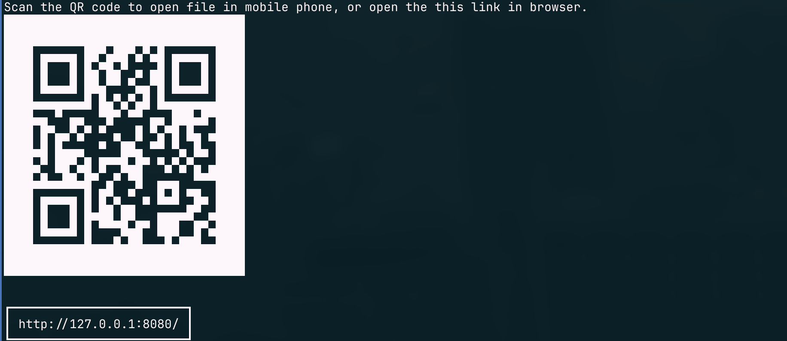
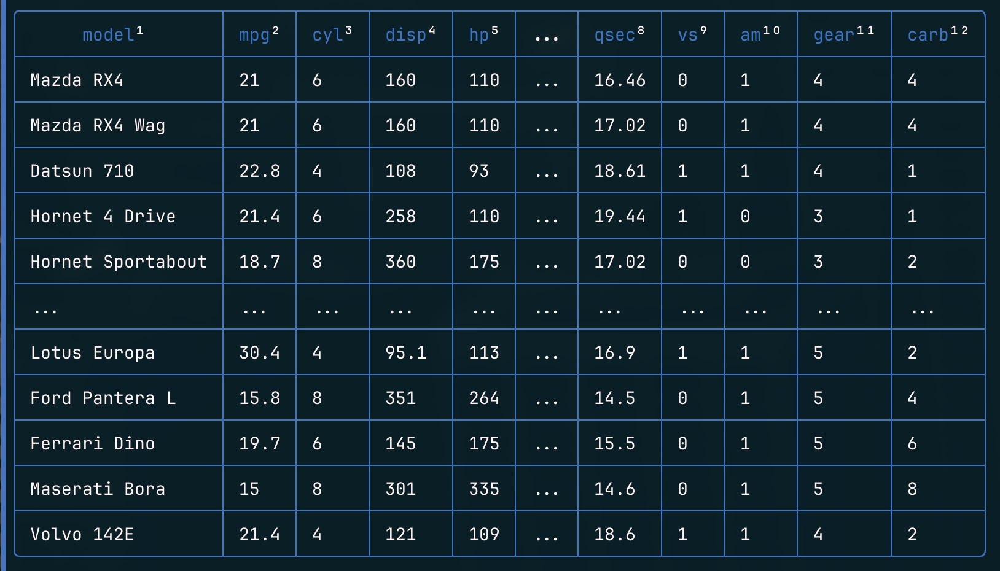
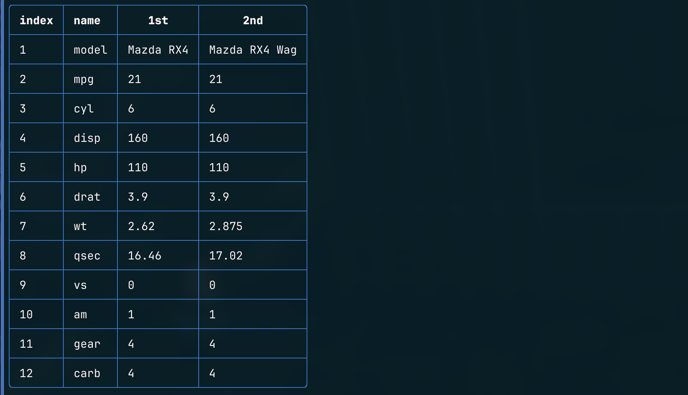
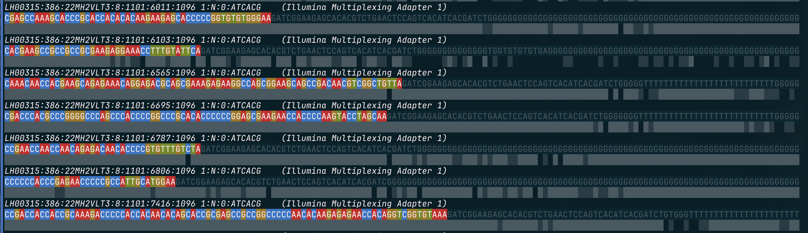
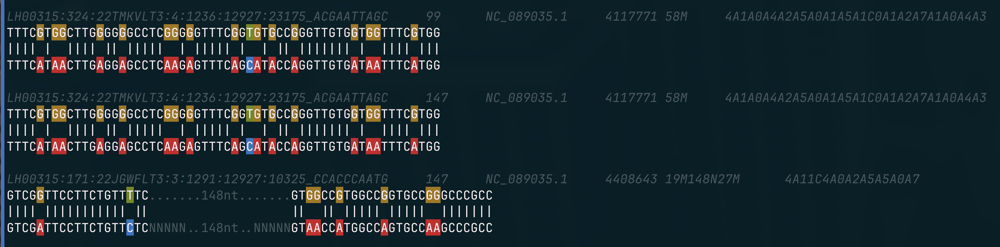

# hey

## Downloads and install

1.  **Download** the appropriate `.tar.gz` files

    - **Linux (amd64)**: [hey-latest-linux-amd64.tar.gz](https://github.com/y9c/hey/releases/download/latest/hey-latest-linux-amd64.tar.gz)
    - **Linux (arm64)**: [hey-latest-linux-arm64.tar.gz](https://github.com/y9c/hey/releases/download/latest/hey-latest-linux-arm64.tar.gz)
    - **macOS (amd64/Intel)**: [hey-latest-darwin-amd64.tar.gz](https://github.com/y9c/hey/releases/download/latest/hey-latest-darwin-amd64.tar.gz)
    - **macOS (arm64/Apple Silicon)**: [hey-latest-darwin-arm64.tar.gz](https://github.com/y9c/hey/releases/download/latest/hey-latest-darwin-arm64.tar.gz)

> [!TIP]
> These binaries are built automatically with each push to the main branch and represent the latest development version.

2.  **Unzip** the downloaded file.

    ```bash
    tar -xzf <downloaded_filename.tar.gz>
    ```

3.  **Make the binary executable** (if necessary):

    ```bash
    chmod +x hey
    ```

## Usage

4.  Now you can run the `hey` binary from your terminal:

    ```bash
    ./hey --help
    ```

    You might want to move the `hey` binary to a directory in your system's PATH (e.g., `/usr/local/bin` or `~/bin`) to make it accessible from anywhere.

## Commands showcase

- **open**: Open file in server with browser.
  
- **tsv**: Preview tsv file in a pretty way.
  
- **colname**: Transpose and format table, showing column names and initial data rows.
  
- **fastq**: Colorize and visualize FASTQ files, including quality scores and adapter detection.
  
- **sam (sam2pairwise)**: Convert SAM records into pairwise alignment format with highlighting.
  
- **stats**: Concatenate and transpose columns from files into a matrix.
- **wc**: Count lines, words, and characters in files (gzip supported).
- **rname**: Identify instrument, flow cell type, and lane from FASTQ read names.
- **rc**: Compute the reverse complement of DNA sequences.
